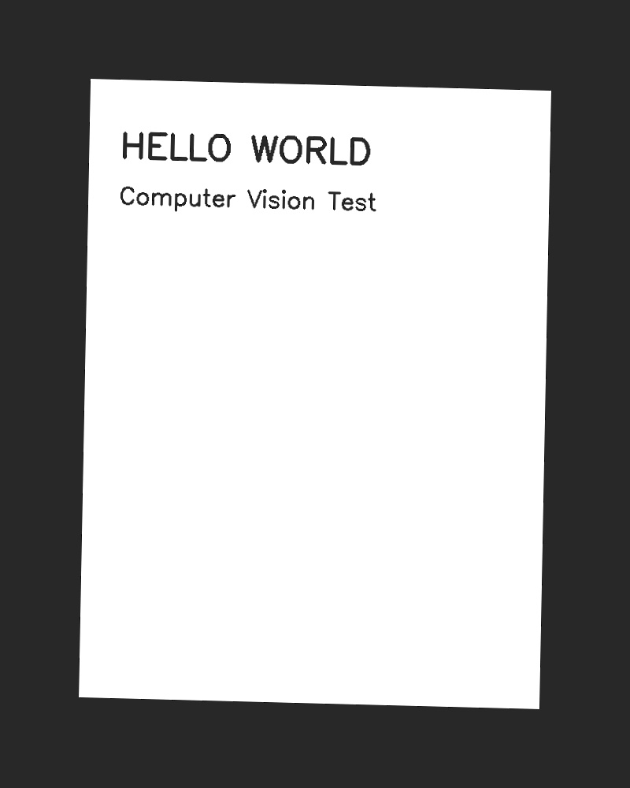
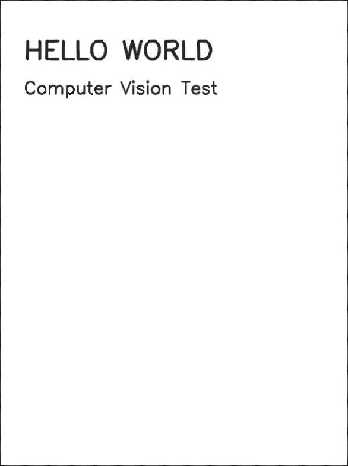
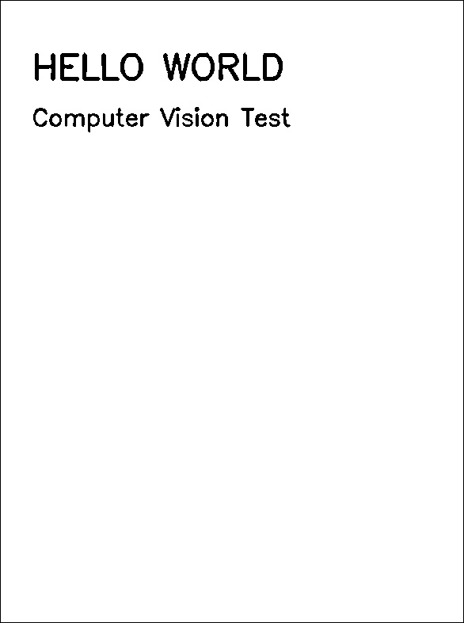

# Document Scanner + OCR Pipeline

A command-line computer vision pipeline that turns a photo of a document
(receipt, page, note, form) into a clean, perspective-corrected scan and
extracts its text via OCR - no GUI required, no cloud API, fully offline.

Built for CSE3010 (Computer Vision), VIT Bhopal - "Build Your Own Project."

## Documentation

Full project report: [docs/report.pdf](docs/report.pdf)

## Table of Contents

- [Documentation](#documentation)
- [Why This Exists](#why-this-exists)
- [Features](#features)
- [Project Structure](#project-structure)
- [How It Works](#how-it-works)
- [Technologies / Tools Used](#technologies--tools-used)
- [Setup & Installation](#setup--installation)
- [Running the Project](#running-the-project)
- [Output Reference](#output-reference)
- [Using the Modules Programmatically](#using-the-modules-programmatically)
- [Testing](#testing)
- [Troubleshooting](#troubleshooting)
- [Performance Notes](#performance-notes)
- [Screenshots / Results](#screenshots--results)
- [Known Limitations](#known-limitations)
- [Possible Extensions](#possible-extensions)

## Why This Exists

Point a phone camera at a printed page and you almost never get it straight. The document is tilted, the corners are at slightly different distances from the lens, the lighting is uneven because someone's shadow is in the shot. None of that stops a human from reading the page, but it wrecks OCR accuracy: Tesseract expects roughly horizontal, evenly lit text, not a trapezoid with a lamp glare down one side.

This project fixes that in three steps: find the page in the photo and warp it back to a flat rectangle, clean up the lighting and binarize it into something that looks like an actual scan, then run OCR and save both the raw text and a structured JSON version with per-word confidence and position.

## Features

- **Document detection & perspective correction** — locates the document's
  boundary in a photo (even at an angle) using Canny edge detection and
  contour analysis, then applies a homography warp to produce a flat,
  top-down view.
- **Image enhancement & binarization** — CLAHE contrast equalization,
  non-local-means denoising, and adaptive thresholding to turn the warped
  photo into a clean, scanner-quality black-and-white page.
- **OCR text extraction** — runs Tesseract OCR over the enhanced image and
  outputs both plain text and structured JSON (per-word text, confidence,
  and bounding box).
- **Graceful degradation** — if no clean document boundary can be found, the
  pipeline falls back to using the full frame instead of failing outright.
- **Structured logging** to both console and a persistent log file, with a
  `--verbose` flag for debug-level detail.
- A fully modular codebase (`src/`) — three independent, swappable modules —
  with an automated unit test suite (`tests/`).

## Project Structure

```
doc-scanner-ocr/
├── src/
│   ├── document_detector.py   # Module 1: detection + perspective correction
│   ├── enhancer.py            # Module 2: enhancement + binarization
│   ├── ocr_extractor.py       # Module 3: OCR + structured output
│   ├── utils.py                # logging & shared helpers
│   └── main.py                 # CLI entry point
├── tests/
│   └── test_pipeline.py        # unit tests for all 3 modules
├── assets/
│   ├── diagrams/                # architecture / workflow / UML diagrams
│   └── screenshots/             # example run screenshots (see below)
├── docs/                       # full project report
├── sample_images/               # example input image(s)
├── requirements.txt
├── README.md
└── statement.md
```

## How It Works

The pipeline is a strict three-stage sequence; each stage's output is the
next stage's input, and each stage is implemented as an independent,
separately-testable Python module.

**Stage 1 — Document Detection & Perspective Correction**
(`src/document_detector.py`)
The input image is downscaled to a fixed height (800px) purely to keep edge
detection fast; all detected coordinates are scaled back up before warping,
so output resolution is unaffected. A Gaussian blur removes high-frequency
noise, `cv2.Canny` finds edges, and `cv2.findContours` returns candidate
boundaries. The five largest contours by area are checked in turn with
`cv2.approxPolyDP` (using an epsilon of 2% of the contour's perimeter); the
first one that approximates to exactly four points is treated as the
document boundary. Its four corners are ordered (top-left, top-right,
bottom-right, bottom-left) using a sum/difference trick — the point with the
smallest x+y sum is top-left, the largest is bottom-right, and the
min/max of the coordinate difference gives top-right/bottom-left — and a
perspective transform is computed with `cv2.getPerspectiveTransform` and
applied with `cv2.warpPerspective`. If no four-point contour is found, the
module logs a warning and falls back to treating the entire frame as the
document, rather than raising an error.

**Stage 2 — Image Enhancement & Binarization** (`src/enhancer.py`)
The warped image is converted to grayscale, then (optionally) passed through
CLAHE — contrast-limited adaptive histogram equalization — which corrects
local lighting variation by equalizing contrast within small tiles (8×8 by
default) rather than across the whole image, avoiding the over-amplification
of noise that global histogram equalization causes in flat regions.
`cv2.fastNlMeansDenoising` then removes residual sensor noise, and
`cv2.adaptiveThreshold` (Gaussian-weighted, 25×25 neighborhood) binarizes the
result — using a *local* threshold per pixel neighborhood instead of one
global cutoff, so a page with a shadow across half of it still binarizes
cleanly on both sides.

**Stage 3 — OCR Text Extraction** (`src/ocr_extractor.py`)
The binarized image is passed to Tesseract via `pytesseract.image_to_string`
for a plain-text transcript, and separately to `pytesseract.image_to_data`
for a word-level breakdown (text, confidence 0–100, and bounding box per
word). These are aggregated into an `OCRResult` dataclass which can
serialize itself to JSON.

**Orchestration** (`src/main.py`) wires the three stages together behind an
`argparse` CLI, writes every intermediate artifact to disk, and prints a
run summary. See `assets/diagrams/process_flow.png` for the full flow
including the fallback branch, and `assets/diagrams/sequence_diagram.png`
for the exact call order between modules.

## Technologies / Tools Used

- **Python 3.10+**
- **OpenCV** (`opencv-python-headless`) — image processing, contour
  detection, perspective transforms (no GUI dependencies, keeping the tool
  scriptable/headless-server-friendly)
- **NumPy** — array operations underlying all image manipulation
- **Tesseract OCR + `pytesseract`** — text extraction (LSTM-based OCR engine)
- **pytest** — unit testing
- **Graphviz** (dev-only) — used to generate the diagrams in
  `assets/diagrams/` from `assets/diagrams/gen_*_diagrams.py`; not required
  to run the tool itself

## Setup & Installation

1. **Clone the repository**
   ```bash
   git clone https://github.com/<github-username>/doc-scanner-ocr.git
   cd doc-scanner-ocr
   ```

2. **Create a virtual environment (recommended)**
   ```bash
   python3 -m venv venv
   source venv/bin/activate      # Windows: venv\Scripts\activate
   ```

3. **Install Python dependencies**
   ```bash
   pip install -r requirements.txt
   ```

4. **Install the Tesseract OCR engine** (a system dependency, not a Python
   package — `pytesseract` is only a wrapper around this binary):
   - **Ubuntu/Debian:** `sudo apt-get install tesseract-ocr`
   - **macOS (Homebrew):** `brew install tesseract`
   - **Windows:** install from the
     [UB-Mannheim Tesseract build](https://github.com/UB-Mannheim/tesseract/wiki)
     and ensure `tesseract.exe` is on your `PATH`.
   - Additional language packs (if needed): `sudo apt-get install tesseract-ocr-<lang-code>`
     (e.g. `tesseract-ocr-hin` for Hindi), then pass `--lang hin` to the CLI.

5. **Verify both installations**
   ```bash
   python3 -c "import cv2, pytesseract; print('OpenCV', cv2.__version__)"
   tesseract --version
   ```

## Running the Project

```bash
python3 -m src.main --input sample_images/sample_receipt.jpg --output-dir output/
```

### CLI Options

| Flag | Description | Default |
|---|---|---|
| `--input`, `-i` | Path to the input image (required) | — |
| `--output-dir`, `-o` | Directory to write results to | `output` |
| `--lang` | Tesseract language code (e.g. `eng`, `hin`, `fra`) | `eng` |
| `--no-clahe` | Disable CLAHE contrast enhancement | off |
| `--min-confidence` | Minimum per-word OCR confidence (0–100) to keep in the structured JSON output | `0` |
| `--verbose`, `-v` | Enable debug-level logging | off |

### Example

```bash
python3 -m src.main -i sample_images/sample_receipt.jpg -o output/ -v
```

## Output Reference

Every run writes the following into `--output-dir` (default `output/`):

| File | Contents |
|---|---|
| `1_warped.jpg` | Perspective-corrected document (Stage 1 output) |
| `2_enhanced.jpg` | Enhanced, binarized scan (Stage 2 output) — this is what gets OCR'd |
| `3_text.txt` | Plain-text OCR transcript |
| `3_result.json` | Structured OCR output: `text`, `mean_confidence`, `word_count`, and a `words` array, each entry `{ text, confidence, bbox: { x, y, w, h } }` |

A run summary (word count, mean OCR confidence, elapsed time, output
location) is printed to the terminal, and a full timestamped log is written
to `scanner.log` in the current working directory (see `src/utils.py:setup_logging`).

## Using the Modules Programmatically

Because each stage is a plain Python module with no hidden global state, the
pipeline can be called from other Python code without going through the CLI
at all — useful for notebooks or integrating into a larger script:

```python
import cv2
from src import document_detector, enhancer, ocr_extractor

image = cv2.imread("my_photo.jpg")
detection = document_detector.detect_and_warp(image)
binarized = enhancer.enhance_document(detection.warped)
result = ocr_extractor.extract_text(binarized)

print(result.text)
print(result.mean_confidence)
```

## Testing

```bash
python3 -m pytest tests/ -v
```

The suite (`tests/test_pipeline.py`) generates synthetic document images on
the fly — a skewed page with printed text rendered onto a dark background —
so it needs no external fixture files and is fully deterministic. It
covers, per module:

- **`document_detector`** — a normal skewed input returns a valid
  `DetectionResult`; an empty/invalid image raises `DocumentNotFoundError`;
  a blank, featureless image correctly triggers the full-frame fallback
  rather than crashing.
- **`enhancer`** — output pixel values are strictly binary (`{0, 255}`)
  after adaptive thresholding; an empty image raises `ValueError`.
- **`ocr_extractor`** — text is correctly extracted from a synthetic page;
  `mean_confidence` is returned as a float; an empty image raises
  `ValueError`; JSON serialization includes all expected fields.

All 8 tests pass (`python3 -m pytest tests/ -v` exits 0). The pipeline was
additionally verified end-to-end via the CLI itself — see
[Screenshots / Results](#screenshots--results).

## Troubleshooting

| Symptom | Likely cause | Fix |
|---|---|---|
| `TesseractNotFoundError` | Tesseract binary not installed or not on `PATH` | Install per [Setup & Installation](#setup--installation) step 4; on Windows, set `pytesseract.pytesseract.tesseract_cmd` explicitly if needed |
| Output image is the *entire* photo, not just the document | No 4-point contour was found (busy background, low contrast at the document edge) | This is the intended fallback, not a crash — try better lighting/contrast, or a plainer background behind the document |
| Low OCR confidence / garbled text | Photo is blurry, or text is very small relative to image resolution | Retake the photo closer / in better focus; the pipeline improves binarization but cannot recover detail that was never captured |
| `ModuleNotFoundError: No module named 'src'` | Running `python3 src/main.py` directly instead of as a module | Run with `python3 -m src.main ...` (note the dot, not slash) so relative imports resolve correctly |
| Unsupported file type error | Input file extension not in the supported list | Use `.jpg`, `.jpeg`, `.png`, `.bmp`, or `.tiff` |

## Performance Notes

- Contour search runs on a fixed-height (800px) downscaled copy of the
  image regardless of input resolution, which bounds Stage 1's cost even
  for very high-resolution phone photos (typically well under 100ms).
- The full pipeline (all 3 stages) completes in under a second for a
  typical single-page document on modest hardware — see the measured
  `0.59s` example run in the project report.
- Memory usage is proportional to a single decoded image held in memory at
  a time; no batching or caching is performed, so memory use does not grow
  with repeated runs in the same process.

## Screenshots / Results

Example run on a synthetically generated test photo (a skewed page against a
dark background — see `tests/test_pipeline.py`):

**Input** — raw photo, document at an angle:



**Module 1 output** — perspective-corrected, de-skewed document:



**Module 2 output** — enhanced, binarized scan (ready for OCR):



**Module 3 output** — extracted text (`3_result.json`, truncated):

```json
{
  "text": "HELLO WORLD\n\nComputer Vision Test",
  "mean_confidence": 96.0,
  "word_count": 5,
  "words": [
    { "text": "HELLO", "confidence": 96.0, "bbox": { "x": 44, "y": 66, "w": 137, "h": 37 } },
    { "text": "WORLD", "confidence": 96.0, "bbox": { "x": 206, "y": 66, "w": 151, "h": 37 } }
  ]
}
```

**CLI summary output:**

```
===== Document Scanner + OCR — Summary =====
Words extracted:    5
Mean OCR confidence:96.0%
Time elapsed:       0.59s
=============================================
```

For architecture and workflow diagrams, see `assets/diagrams/`.

## Known Limitations

- Assumes the document is roughly "upright" in the frame; does not detect
  or correct 90°/180° rotation on its own.
- Boundary detection assumes reasonable contrast between the document edge
  and its background; a document photographed on a busy or similarly-toned
  surface may trigger the full-frame fallback.
- Tuned and tested for printed text; handwriting recognition accuracy will
  be substantially lower, as Tesseract's default models are not trained for
  it.
- Single-image input only; no batch or multi-page mode (see Future
  Enhancements in the project report).

## Possible Extensions

- Accept a directory or a multi-page PDF and process every page in one run.
- Detect and correct orientation in addition to perspective.
- Group OCR output into lines and paragraphs instead of a flat word list, using the bounding box data already being collected.
- Swap Tesseract for a cloud OCR API behind the same `ocr_extractor` interface for better accuracy on messier inputs.

For architecture, use-case, class, and sequence diagrams, see `assets/diagrams/`.